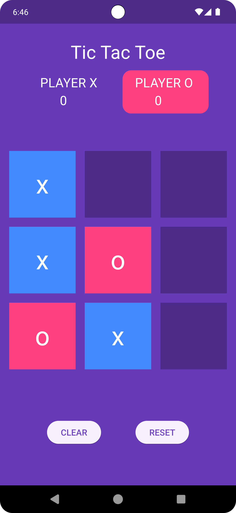
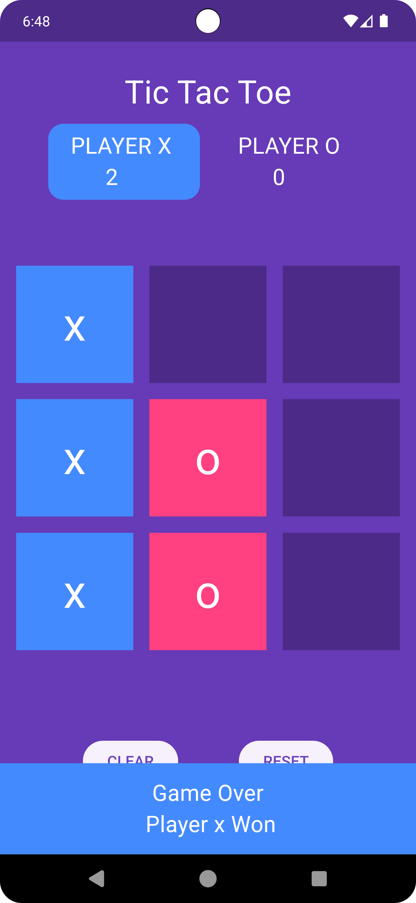

# 🎮Tic Tac Toe Flutter App🎮

A simple Tic Tac Toe game built with Flutter and Dart for two players, featuring background sound. This project demonstrates the use of the Flutter framework along with `flame_audio` for sound effects and `flutter_launcher_icons` for custom app icons.

## 🎮Project Structure

The project is organized as follows:

tic_tac_toe/   
│ ├── lib/  
│ ├── [main.dart](./lib/main.dart)   
│ └── [home_page.dart](./lib/home_page.dart)  
│ ├── [pubspec.yaml](./pubspec.yaml)   
└── README.md  


- **`lib/main.dart`**: The entry point of the application.
- **`lib/home_page.dart`**: The main page where the game is played.

## 🎮Dependencies

This project uses the following external dependencies:

- **`flame_audio: ^2.10.1`**: For playing background sound and sound effects.
- **`flutter_launcher_icons: ^0.13.1`**: For custom app icons.

## 🎮Getting Started

To get started with the Tic Tac Toe Flutter app, follow these steps:

1. **Clone the repository:**

    ```bash
    git clone https://github.com/yourusername/tictactoe_flutter.git
    cd tictactoe_flutter
    ```

2. **Install dependencies:**

    Ensure you have Flutter installed. Then, run:

    ```bash
    flutter pub get
    ```

3. **Run the app:**

    You can run the app on an emulator or physical device using:

    ```bash
    flutter run
    ```

## 🎮Configuration

1. **Setting up `flutter_launcher_icons`:**

   Configure your app icon in the `pubspec.yaml` file under the `flutter_launcher_icons` section. For example:

    ```yaml
    flutter_launcher_icons:
      android: true
      ios: true
      image_path: "assets/icon/app_icon.png"
    ```

   Replace `assets/icon/app_icon.png` with the path to your app icon image.

2. **Playing Background Sound:**

   Make sure to place your audio files in the appropriate assets directory and configure them in `pubspec.yaml`:

    ```yaml
    flutter:
      assets:
        - assets/sounds/background_music.mp3
    ```

## 🎮Contributing

Feel free to open issues, submit pull requests, or contribute in any way to improve the app.

Contributions are welcome! To contribute:

- Fork the repository.
- Create a new branch (git checkout -b feature/YourFeature).
- Make your changes.
- Commit your changes (git commit -am 'Add some feature').
- Push to the branch (git push origin feature/YourFeature).
- Create a Pull Request.

### Happy coding!
## 🎮Screenshots

<div>
  


  
</div>

## 🎮Demo 

[](https://github.com/user-attachments/assets/e588e15b-8386-4b6b-b1c8-757035d24655)
